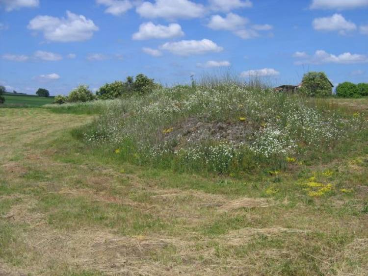

```{r setup, include=TRUE, warning = FALSE, message = FALSE}
knitr::opts_chunk$set(echo = TRUE, warning = FALSE, message = FALSE)
library(tidyverse) #all hail the tidyverse
library(readxl) #reading in xls
library(here) #easy reading
library(ggfortify) # biplot creation
```

## Introduction
For task 1, I will be exploring patterns within a data set on vegetation samples of acidophilous grasslands (16-25m^2) recorded in 2004-2007. This data was compiled and provided by David Zelený on davidzeleny.net. The locality of these vegetation samples is described "North of Třebíč city, Czech Republic. Grasslands typically occur on convex topography with shallow soils, and form “islands” (habitat patches) of acidophilous vegetation in otherwise intensively manages agricultural landscape." 




**Reference:** Zelený D. & Li Ch.-F. (2008): Vegetace suchých acidofilních trávníků v oblasti třebíčského žulosyenitového plutonu [Dry acidophilous grassland vegetation in the area of Třebíč's granosyenite pluton] - Acta Rerum Naturalium, 5: 177-194 pdf https://www.davidzeleny.net/anadat-r/doku.php/en:data:grasslands


I will be exploring this data using a Principal components analysis (PCA). What is a PCA? A PCA reprojects original axes in a data set to new principal components that capture the greatest amount of variance in a multivariate data set. PCA results can be visualized as biplots and screeplots. 


## Data wrangling 
To prepare my data for a PCA, I will drop categorical and character data, and exclude any rows with NAs. I should also rescale so all numeric variables have a mean 0 and sd 1. Additionally, this dataset contains location information that I won't be needing. 

First, I read in my data and drop rows with NAs, and drop categorical and character data. Then, I'll rescale all of my numeric variables to have a mean of 0 and a standard dev of 1.
```{r}
#reading in my data set
veg <- read_excel(here("data","grasslands-spe-env.xls"), sheet = 2) %>% # this excel file had several pages including metadata. I read in sheet 2, which has the variables I'm looking to explore
  drop_na() %>% # dropping any rows with NAs
  mutate(classification = factor(
    classification, levels = c('FVd', 'JmFo', 'PhFr', 'PpSp', 'VvAp'))) %>% #If I factor these veg classification levels now, I can vizualize them later on my biplot and see if there's anything interesting
  dplyr::select(-plot, -area, -starts_with(c('lat','long'))) %>% # here i'm dropping some spatial variables that I'm not interested in for this analysis
  dplyr::rename(cover_shrub = coverE2, cover_herb = coverE1) # I am just renaming these columns so they're easier to understand later 
  
#now I make a PCA out of my dataset. I'll need to drop those veg class layers here, put all my #s on similar scale, and use prcomp() to create the PCA
veg_pca <- veg %>% 
  dplyr::select(where(is.numeric)) %>% #keeping only my numeric values
  scale() %>% #putting all my variable #s on a similar scale
  prcomp() #creating PCA


```


```{r}
# See the loadings (weighting for each principal component)
#veg_pca$rotation
```
## Creating professional-looking PCA Biplots with ggplot and autoplot() 
Here I go about two different methods for creating biplots, first by hand with ggplot(), and then with autoplot().
```{r}
#Putting my loadings into a clean df with axis names
loadings_df <- data.frame(veg_pca$rotation*7) %>% #My biplot was looking crowded, so I used *8 to space out my lines 
  mutate(axis = row.names(.))

new_pts_df <- data.frame(veg_pca$x) #creating pts for my biplot 

#plotting my PC1 &PC2
PCA1_PCA2_plot <- ggplot()+
  geom_point(data = new_pts_df, aes(x= PC1, y = PC2), color = "lightgrey")+
  geom_segment(data = loadings_df, x = 0, y =0,
               aes(xend=PC1, yend=PC2, group = axis),
               arrow = arrow(length = unit(.25,"cm"))) +
  geom_text(data = loadings_df, 
            aes(x=PC1, y= PC2, label = axis)) +
  theme_minimal()
#plotting my PC2&PC3
PCA2_PCA3_plot <- ggplot()+
  geom_point(data = new_pts_df, aes(x= PC2, y = PC3), color = "lightgrey")+
  geom_segment(data = loadings_df, x = 0, y =0,
               aes(xend=PC2, yend=PC3, group = axis),
               arrow = arrow(length = unit(.25,"cm"))) +
  geom_text(data = loadings_df, 
            aes(x=PC2, y= PC3, label = axis)) +
  theme_minimal()
```


```{r}
#creating biplot with autplot. This way is a little faster
veg_autoplot <- autoplot(veg_pca, 
         data = veg,
         loadings = TRUE,
         loadings.label = TRUE,
         loadings.color = "black",
         colour = 'classification',
         loadings.label.colour = "black",
         loadings.label.vjust = -0.5)  +
  theme_minimal()
```
To further explore my data, I can create a screeplot to see how the variance is captured by my principle compenents. I can create a screeplot by hand, or use screeplot()
```{r}

## Screeplot by hand
sd_vec <- veg_pca$sdev
var_vec <- sd_vec^2 ### standard deviation is sqrt of variance!
pc_names <- colnames(veg_pca$rotation)

pct_expl_df <- data.frame(v = var_vec,
                          pct_v = var_vec / sum(var_vec),
                          pc = fct_inorder(pc_names)) %>%
  mutate(pct_lbl = paste0(round(pct_v*100, 1), '%'))

screeplot_veg <- ggplot(pct_expl_df, aes(x = pc, y = v)) +
  geom_col(fill = "lightblue") + #adding a touch of color
  geom_text(aes(label = pct_lbl), vjust = 0, nudge_y = .002) +
  labs(x = 'Principal component', y = 'Variance explained') +
  theme_minimal()
#based on this screeplot, I only need to keep up to PC6 to capture 80% of the variance in this data 

# I also have the option of using screeplot()
# Variance explained by each PCA
#screeplot(veg_pca, type = "lines")
#screeplot(veg_pca, type = "barplot")
```


## Final visualization and summary 
```{r}
PCA1_PCA2_plot 

```

**Figure A:** A PCA biplot for the variance in grassland environmental variables. PC1 and PC2 capture 40% of the variance for this PCA. The loadings of variables are displayed as arrows. Arrows with a small angle between them implies positive correlation between the variables. From this biplot, we can see that the cover moss % is positively correlated with slope angle, and bare cover % is positively correlated with aspect angle. 

```{r}
PCA2_PCA3_plot
```

**Figure B:** A PCA biplot for the variance in grassland environmental variables. PC2 and PC3 capture 27.4% of the variance for this PCA. The loadings of variables are displayed as arrows. Arrows with a small angle between them implies positive correlation between the variables. From this biplot, we can see that the herb cover % is positively correlated with lichen cover %, and cover shrub, altitude, and aspect are all positively correlated. 
```{r}
screeplot_veg
```

**Figure C:** PCA Screeplot of Environmental variables for grassland samples. This screeplot drops off gradually, and requires 6 principal components to capture 80% of the data. 

Overall, these biplots indicate that there is a relationship between  slope, aspect and altitude on cover vegetation. 

 -  Moss cover vegetation is positively correlated with a high slope angle
 -  Shrub cover is positively correlated with high altitude and aspect

The screeplot drops of gradually, meaning that only 40% of the variance is captured in PC1 and PC2. Exploring the other PCs, like PC2 and PC3 can help capture a higher % of variance.
